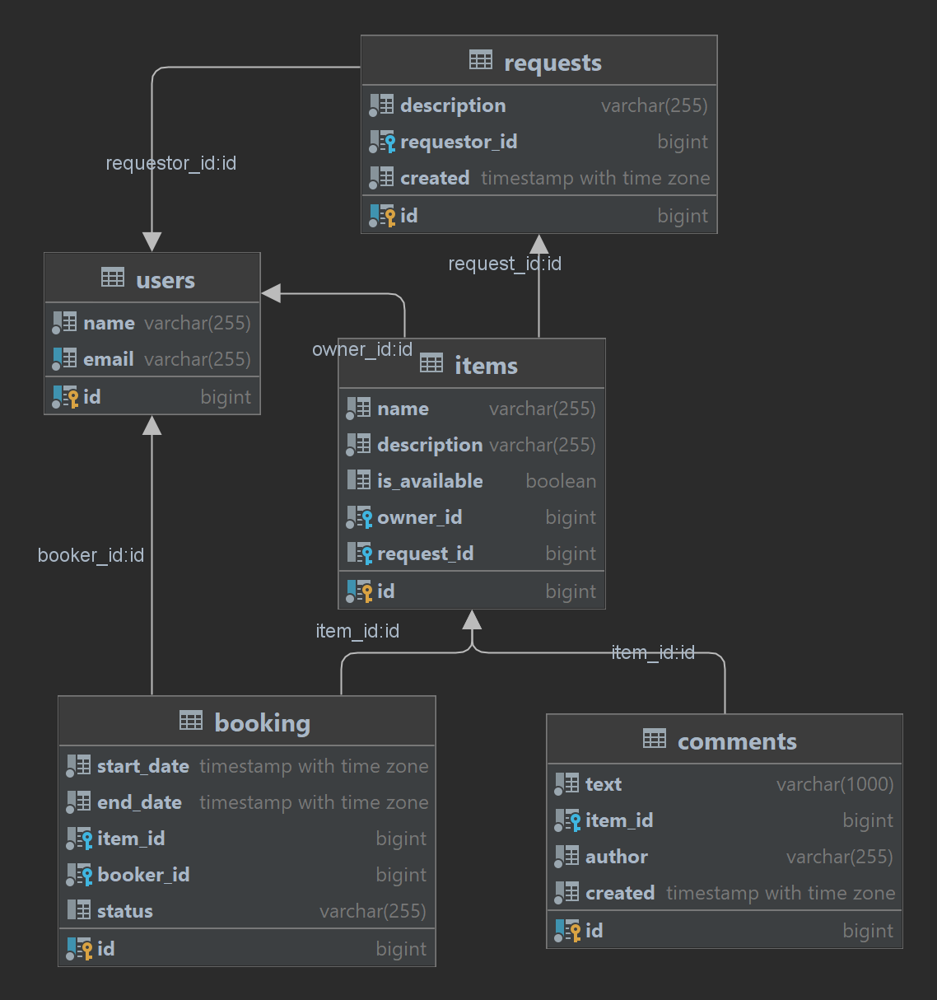

# Share It
## Описание проекта

Приложение обеспечивает пользователям  возможность рассказывать, какими вещами они готовы поделиться. А так же находить нужную вещь и брать её в аренду на какое-то время.

Сервис позволяет бронировать вещь на определённые даты, закрывает доступ к ней на время бронирования от других желающих. 

На случай, если нужной вещи на сервисе нет, у пользователей есть возможность оставить запрос. По запросу можно будет добавлять новые вещи для шеринга.

## Функционал
-	Добавление пользователем новой вещи, редактирование полей (может делать только её владелец)
-	Просмотр информации о конкретной вещи по её id (доступно для всех пользователей)
-	Просмотр пользователем списка всех его вещей
-	Поиск вещи потенциальным арендатором (в названии или описании вещи)
-	Добавление нового запроса на бронирование. Запрос может быть создан любым пользователем, а затем подтверждён владельцем вещи
-	Получение данных о конкретном бронировании (включая его статус). Может быть выполнено либо автором бронирования, либо владельцем вещи, к которой относится бронирование.
-	Получение списка всех бронирований текущего пользователя  (возвращается отсортированным по дате от более новых к более старым)
-	Получение списка бронирований для всех вещей текущего пользователя
-	Добавление нового запроса на вещь (в тексте запроса пользователь описывает, какая именно вещь ему нужна)
-	Получение списка своих запросов вместе с данными об ответах на них.  (возвращаться в отсортированном порядке от более новых к более старым)
-	Получение списка запросов, созданных другими пользователями. С помощью этого эндпоинта пользователи смогут просматривать существующие запросы, на которые они могли бы ответить. (сортируются по дате создания: от более новых к более старым)
-	Получение данных об одном конкретном запросе вместе с данными об ответах на него  по id
- Разработан отдельный шлюз (gateway) для валидации входящих запросов
- Основное приложение, шлюз валидации (gateway) и БД запускаются раздельно из docker-контейнеров

## Тестирование

-	Реализованы юнит-тесты для всего кода, содержащего бизнес логику
-	Реализоваты интеграционные тесты, проверяющие запросы к базе данных
-	Реализованы тесты для REST-эндпоинтов приложения с использованием MockMVC
-	Реализованы тесты для слоя репозиториев вашего приложения с использованием @DataJpaTest
-	Реализовать тесты для работы с JSON для DTO в приложении с помощью аннотации @JsonTest

## Схема БД

## Стек
Java 11, Spring Framework, Spring Boot, Hibernate, JUnit, Mockito, PostgreSQL, REST, JPA, Maven, Lombok, Docker 